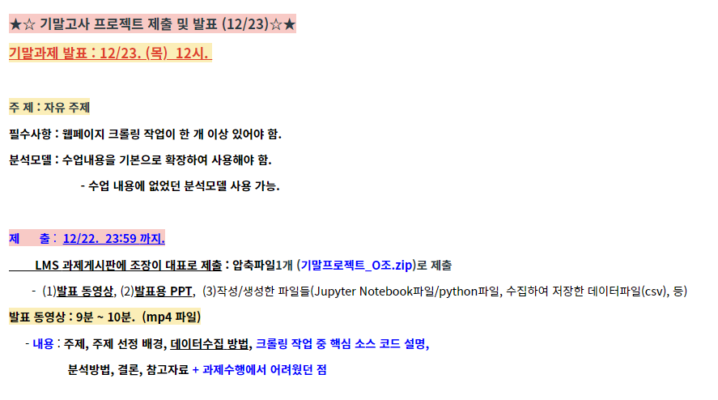

## 공지

## 주제
- 웹 크롤링을 이용한 취업 공고 스케줄러

## 스케줄
- [x] 주제 정하기
- [x] 코딩하기
- [x] 핵심 코드 설명 + 피피티 구조 구상 // 12/4 토
- [x] 피피티 + 스크립트(대본) 제작 + 녹화 // ~ 12/10 ~ 12/11 금~토
- [x] 영상 편집 // ~12/11 토

## 웹크롤러
- [사람인_평균연봉 1000개](https://replit.com/@98mirinae/WebCrawler#main.py)

## 주제 선정 배경
- 마지막 학기를 보내며 취업 전선에 뛰어들려 하니 여러 가지 생각해야 할 게 많았다. 학교라는 좁은 사회를 벗어나 더 큰 물에 뛰어들려 보니 겁부터 났다. 수영 전 준비운동을 하듯 내가 취업하기 위해 먼저 채용 정보를 수집해야 겠다고 생각했다.
- IT 내에서도 트렌드와 어떤 분야에서 사람을 많이 구하는지 알고 싶었다. 그를 위해 스택 오버플로우에서 User-Agent 를 확인 후 채용 공고 크롤링을 수행했다.
- 우리나라 내에서 각자의 분야에 종사하는 사람들이 평균 연봉으로 얼마를 받는지 알고 싶어서 여러 취업 사이트 중 하나인 '사람인'에서 User-Agent 를 확인 후 평균 연봉 정보를 크롤링했다. 최근 1000개만 수행해보았다. (10000개 해도 될 듯하다.)

## 데이터 수집 방법
- 사람인, 스택오버플로우에서의 채용 공고를 긁어오기로 했다.
- 따로 만든 크롤러 파일(연봉정보, 채용공고)에서 CSV 로 데이터를 추출한다.

## 크롤링 작업 중 핵심 코드 설명
- 연봉 정보 파일은 주석 달기 완료

## 분석 방법
- 주제어(키워드) 빈도 분석
- 주제어(키워드) 중요도 분석
- 텍스트 마이닝
- [참고한 링크](https://news.samsungdisplay.com/22907/)

## 결론
- 어떠한 분야에서의 국내 평균 연봉은 이렇다!
- 요새는 세계적으로 IT 내 이쪽 분야가 트렌드다! 사람을 많이 뽑는다!

## 참고자료
- 사람인 사이트
- 스택 오버플로우 사이트

## 과제 수행에서 어려웠던 점
- User-Agent 에서 크롤링을 허락해주는 사이트 중 URL 에 페이지의 숫자가 나타나는 사이트를 찾기 어려웠다.
- 직무 별 

## PPT 구성
[1] - 주제 
[2] - 주제 선정 배경 
[3] - 데이터 수집 방법 
[4] - 크롤링 작업 중 핵심 소스 코드 설명 
[5] - 분석방법/모델 
[6] - 결론 
[7] - 참고자료 
[8] - 과제 수행에서 어려웠던 점

## PPT 상세 구성
  * 스택 오버 플로우
    * 직종별 구인수 (Front/Back) (NCS IT 직무 8개)
    * 나라별 구인 직종
  
  * [사람인](https://www.saramin.co.kr/zf_user/salaries/total-salary/list?list_type=total&mcode=&company_type=&rec_status=&order=rank&search_type=total_salary&search_company_nm=&min_salary=1000&max_salary=10000)
    * 1000개의 임의의 기업에 따른 최고 연봉 (5) 과 최저 연봉 (5)
        * 최고 같은 경우 은행이나 다른 업종
        * 최저 같은 경우 서비스 업종
    * 기업형태에 따른 연봉 구간 (중소/중견/대)
    * 산업(업종)에 따른 연봉 구간 
    * 코스닥/코스피에 따른 연봉 구간 차이?

  * 현재 취업하려고 하는 사람들에게 어떤 직무가 자신에게 나을지 판단 -> 결론
    * 직무별 수요에 따라서 결과 표시 (스택)
    * 연봉을 중요시 여긴다면 결과 표시 (사람인)

## 분석 결과

* 스택 오버 플로우
    * 직종별 구인수 (Front/Back) (NCS IT 직무 8개)
       * 분석 결과 여따 써줘요
       * 대략 밑에 작성하라는 의미
       * Front / Back
       * 직무 8개 별로
    * 나라별 구인 직종
  
  * 사람인
    * 1000개의 임의의 기업에 따른 최고 연봉 (5) 과 최저 연봉 (5)
        * 최고 같은 경우 은행이나 다른 업종
        * 최저 같은 경우 서비스 업종
    * 기업형태에 따른 연봉 구간 (중소/중견/대)
    * 산업(업종)에 따른 연봉 구간 
    * 코스닥/코스피에 따른 연봉 구간 차이?